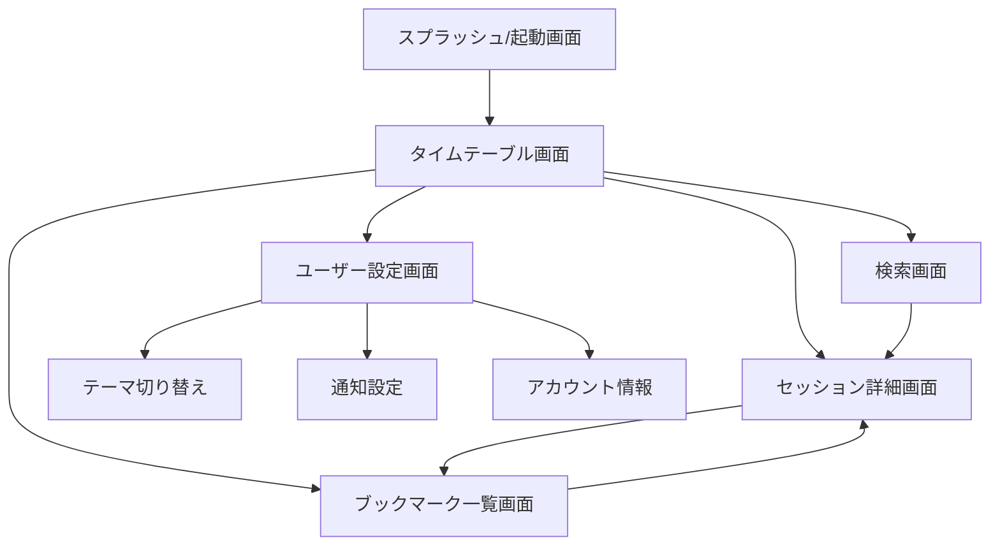

# 画面遷移図（conference-app-2023）

## Mermaid記法による画面遷移図

---

## テキストによる画面遷移例

- スプラッシュ/起動画面
  - ↓
- タイムテーブル画面
  - → セッション詳細画面
  - → 検索画面
  - → ブックマーク一覧画面
  - → ユーザー設定画面
- セッション詳細画面
  - → ブックマーク一覧画面
- 検索画面
  - → セッション詳細画面
- ブックマーク一覧画面
  - → セッション詳細画面
- ユーザー設定画面
  - → テーマ切り替え
  - → 通知設定
  - → アカウント情報

---

> この図はDroidKaigi公式アプリの一般的な画面遷移例をもとに作成しています。
> 詳細な遷移や追加画面が必要な場合はご指示ください。
